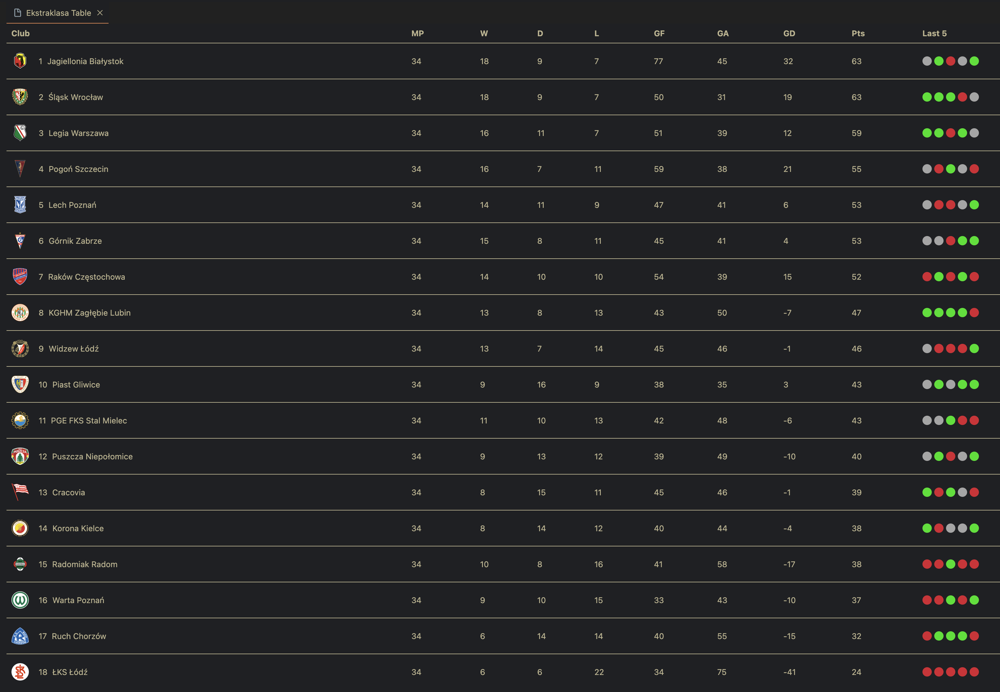

  <h1>Ekstraklasa Extension</h1>
  

## Features

With this extension you can quickly check what is happening in your favourite football league without leaving a VSCode!

Just press `cmd + shift + P` and type in `Ekstraklasa Table` - it's that simple!

